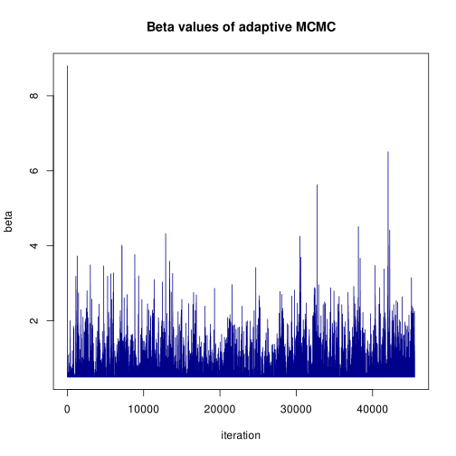
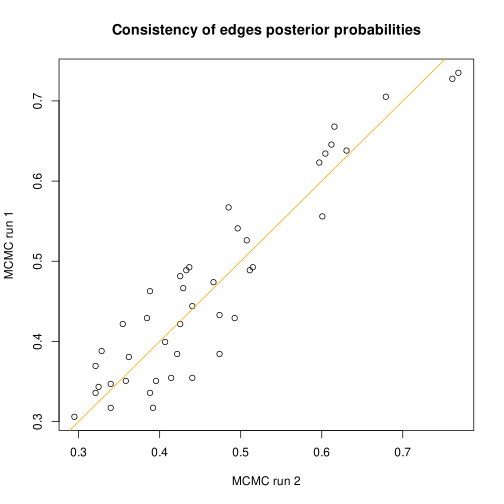
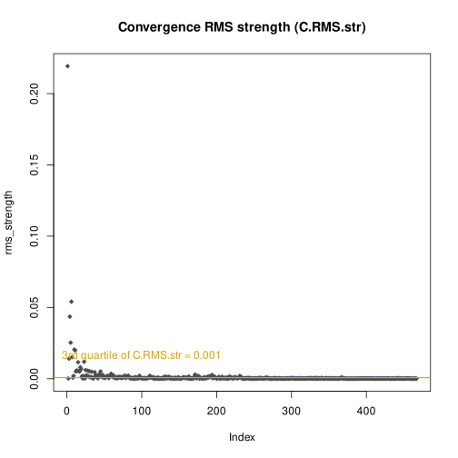

<style type="text/css">
  body{
  font-size: 11pt;
  font-family: sans serif;
}
</style>


```{r, include = FALSE}

knitr::opts_chunk$set(
  collapse = TRUE,
  comment = "#>"
)
knitr::opts_chunk$set(fig.width=8, fig.height=7) 

```


## Summary
<style>
div.blue { background-color:#e6f0ff; border-radius: 5px; padding: 20px;}
</style>
<div class = "blue">

IntOMICS is an efficient integrative framework based on Bayesian networks. IntOMICS systematically analyses gene expression (GE), DNA methylation (METH), copy number variation (CNV) and biological prior knowledge (B) to infer regulatory networks. IntOMICS complements the missing biological prior knowledge by so-called empirical biological knowledge (empB), estimated from the available experimental data. An automatically tuned MCMC algorithm (Yang and Rosenthal, 2017) estimates model parameters and the empirical biological knowledge. Conventional MCMC algorithm with additional Markov blanket resampling (MBR) step (Su and Borsuk, 2016) infers resulting regulatory network structure consisting of three types of nodes: GE nodes refer to gene expression levels, CNV nodes refer to associated copy number variations, and METH nodes refer to associated DNA methylation probe(s). Regulatory networks derived from IntOMICS provide deeper insights into the complex flow of genetic information. IntOMICS is a powerful resource for exploratory systems biology and can provide valuable insights into the complex mechanisms of biological processes that has a vital role in personalised medicine.

IntOMICS takes as input:

1. gene expression matrix,  
2. associated copy number variation matrix sampled from the same individuals,  
3. associated DNA methylation matrix of beta-values sampled from the same individuals, and  
4. the biological prior knowledge with information on known interactions among molecular features.   

The resulting regulatory network structure contains the edge weights $w_i$ representing the empirical frequency of given edge over samples of network structures from two independent MCMC simulations.

For further details about the IntOMICS algorithm, its performance and benchmark analysis, see manuscript Pacinkova \& Popovici, 2022.

</div>

{width=65%}

$$\\[0.1in]$$

## Installation

```{r include = TRUE, echo = TRUE, eval=FALSE}

library(remotes)
install_github("anna-pacinkova/IntOMICS")  

```

## Usage

This tutorial will show you how to use the IntOMICS package with a toy example. The example dataset consisting of processed gene expression and DNA methylation (Illumina Infinium HumanMethylation450 BeadChip) is from the TCGA data portal (https://portal.gdc.cancer.gov/): 30 colon cancer samples (COAD) with microsatellite instability (MSI). The copy number variation of the associated genes from TCGA-COAD samples were downloaded from the Broad Institute GDAC Firehose. We choose the set of 8 genes from the KEGG Colorectal cancer pathway (https://www.genome.jp/pathway/hsa05210).


### Part 1: Input data

```{r include = TRUE, echo = TRUE}

library(IntOMICS)
data(list=c("BN_mod_res", "PK", "TFtarg_mat", "annot", "gene_annot", "layers_def", "omics"), package="IntOMICS")
# load required libraries

suppressPackageStartupMessages({
library(bnlearn)
library(bnstruct)
library(matrixStats)
library(parallel)
library(RColorBrewer)
library(bestNormalize)
library(igraph)
library(gplots)
})

```


IntOMICS framework takes as input:  
  
1. gene expression matrix $GE$ ($m$ x $n_1$) with microarray intensities or RNA-seq count data transformed into a continuous domain ($m$ samples and $n_1$ features)
  
2. associated copy number variation matrix $CNV$ ($m$ x $n_2$) with continuous segment mean values derived for each gene ($n_2 \leq n_1$),
  
3. associated DNA methylation matrix of beta-values $METH$ ($m$ x $n_3$),
  
4. data.frame including all known interactions between molecular features (information from public available databases such as KEGG (Ogata et al., 1999) or REACTOME (Wu \& Haw, 2017)). Any other source of prior knowledge can be used. (IntOMICS is designed to run even if prior knowledge is not available. However, we highly recommend to use it.)

5. logical matrix with known transcription factors (TFs) and its targets (information from public available databases such as ENCODE (ENCODE Project Consortium, 2004). Any other source can be used. (IntOMICS is designed to run even if any TF-target interaction is not available.)
  
All data matrices are sampled from the same individuals.  

Available omics data saved in a names list `omics` in the example TCGA COAD MSI dataset are gene expression (GE) of 7 genes + copy number variation (CNV) of 7 genes + beta value of 115 DNA methylation (METH) probes:

```{r echo=TRUE, include=TRUE}

omics$ge[1:5,1:5]

```
These values correspond to normalised RNA-seq data. 
However, the user is not limited to this platform. Another assay, such as microarray data, can be used. The column names of `omics$ge` matrix must be entrez ID in the format ENTREZID:XXXX.


```{r echo=TRUE, include=TRUE}

omics$cnv[1:5,1:5]

```
These copy number values represent segment mean values equal to $log_2(\frac{copy-number}{2})$.
The column names of `omics$cnv` matrix must be entrez ID in the format entrezid:XXXX.
In the `omics$cnv` matrix, define only columns with available CNV data.


```{r echo=TRUE, include=TRUE}

omics$meth[1:5,1:5]

```
These values represent DNA methylation beta values. The column names of the `omics$meth` matrix are probe IDs.  

IntOMICS is designed to infer regulatory networks even if the copy number variation or DNA methylation data (or both) are not available. In such a case, omics must be a named list with a single element (matrix with gene expression). 

If methylation data are available, we have to provide an annotation:
```{r echo=TRUE, include=TRUE}

str(annot)

```
`annot` is a named list. Each component of the list is a character vector and corresponds to probe IDs associated with a given gene. Names of the annot must be again in the format ENTREZID:XXXX.  

To generate comprehensive figures with gene IDs, we need to provide a gene annotation table:
```{r echo=TRUE, include=TRUE}

gene_annot

```
`gene_annot` is Gene ID conversion table with "entrezID" and "gene_symbol" column names. Gene symbols are used for the final regulatory network visualisation.    

And finally, the prior knowledge from any source chosen by the user:
```{r echo=TRUE, include=TRUE}

PK

```
`PK` is the data.frame with biological prior knowledge about known interactions between features. Column names are "src_entrez" (the parent node), "dest_entrez" (the child node) and "edge_type" (the prior knowledge about the direct interaction between parent and child node; the allowed values are "present" or "missing").

```{r echo=TRUE, include=TRUE}

TFtarg_mat[1:5,1:5]

```
`TFtarg_mat` is the logical matrix with known transcription factors (TFs) and its targets. TFs are listed in columns, corresponding targets are listed in rows.


### Part 2: Data preprocessing

The first step is to define the biological prior matrix and estimate the upper bound of the partition function needed to define the prior distribution of network structures.
We also need to define all possible parent set configurations for each node.  For each parent set configuration, we compute the energy (needed to define the prior distribution of network structures) and the BGe score (needed to determine the posterior probability of network structures).
These functionalities are available through the `OMICS_module` function.  
We can use linear regression to filter irrelevant DNA methylation probes. We set the parameter "lm_METH = TRUE".
We can also specify the threshold for the R^2 to choose DNA methylation probes with significant coefficient using argument "r_squared_thres" (default = 0.3), or p-value using "p_val_thres" (default = 0.05).  
There are several other arguments: "woPKGE_belief" (default = 0.5) refers to the belief concerning GE-GE interactions without prior knowledge, "nonGE_belief" (default = 0.5) refers to the belief concerning the belief concerning interactions of features except GE (e.g. CNV-GE, METH-GE), "TFBS_belief" refers to the belief concerning the TF and its target interaction (default = 0.75).
Note that all interactions with belief equal to "woPKGE_belief" in biological prior knowledge will be updated in empirical biological knowledge.
```{r echo=TRUE, include=TRUE}

OMICS_mod_res <- OMICS_module(omics = omics, 
                              PK = PK, 
                              layers_def = layers_def, 
                              TFtargs = TFtarg_mat,
                              annot = annot, 
                              r_squared_thres = 0.1, 
                              lm_METH = TRUE)

```

This function returns several outputs:
```{r echo=TRUE, include=TRUE}

names(OMICS_mod_res)

```
1. `OMICS_mod_res$pf_UB_BGe_pre` is a list that contains:
- `OMICS_mod_res$pf_UB_BGe_pre$partition_func_UB` the upper bound of the partition function for hyperparameter 
$\beta = 0$,
- `OMICS_mod_res$pf_UB_BGe_pre$parents_set_combinations` all possible parent set configuration for given node,
- `OMICS_mod_res$pf_UB_BGe_pre$energy_all_configs_node` energy for given parent set configurations,
- `OMICS_mod_res$pf_UB_BGe_pre$BGe_score_all_configs_node` BGe score for given parent set configurations.  
2. `OMICS_mod_res$B_prior_mat` is a biological prior matrix.
3. `OMICS_mod_res$annot` contains DNA methylation probes that passed the filter.  
4. `OMICS_mod_res$omics` is a list with gene expression, copy number variation and normalised methylation data (possibly filtered if we use "lm_METH = TRUE").
5. `OMICS_mod_res$omics_meth_original` the original methylation data.


### Part 3: MCMC simulation

Now, we can use the automatically tuned MCMC algorithm (Yang and Rosenthal, 2017) to estimate model parameters and empirical biological knowledge and the conventional MCMC algorithm with additional Markov blanket resampling step (Su and Borsuk, 2016) to infer regulatory network structure consisting of three types of nodes: GE, CNV and METH nodes. 
This step can be time-consuming (you can skip it and use the pre-computed result -> R object `BN_mod_res`).
```{r echo=TRUE, include=TRUE, eval=FALSE}

BN_mod_res <- BN_module(burn_in = 100000, 
                        thin = 500, 
                        seed1 = 101,
                        seed2 = 505,
                        OMICS_mod_res = OMICS_mod_res,
                        minseglen = 50000)

```

There are two optional arguments: "len" specifies the initial width of the sampling interval for hyperparameter $\beta$. However, this parameter will be tuned during the adaptive phases of the MCMC algorithm. "prob_mbr" specifies the probability of the MBR step (default = TRUE). We strongly recommend to use the default setting (for further details on how this argument affects MCMC scheme results, see (Su and Borsuk, 2016)).

Let's check the outputs of `BN_module` function:
```{r echo=TRUE, include=TRUE}
names(BN_mod_res)
```

1. `BN_mod_res$B_prior_mat_weighted` is empirical biological knowledge matrix. Interactions from the biological prior knowledge and TFs-target interactions are constant (if "TFBS_belief" is not equal to "woPKGE_belief").
2. `BN_mod_res$sampling.phase_res` is a named list with results from the last sampling phase of the algorithm:
- `BN_mod_res$sampling.phase_res$rms` trace of root mean square used for c_rms measure to evaluate the convergence of MCMC simulation,
- `BN_mod_res$sampling.phase_res$mcmc_sim_part_res` contains CPDAGs of two independent MCMC simulations (for details see (Pacinkova \& Popovici, 2022)).
4. `BN_mod_res$beta_tuning` is a named list for each iteration of adaptive phases that contains:
- `BN_mod_res$beta_tuning$value` trace of hyperparameter beta tuning,
- `BN_mod_res$beta_tuning$len` trace of width of the sampling interval for hyperparameter $\beta$.


### Part 4: MCMC diagnostics

Trace plots provide an important tool for assessing mixing of a Markov chain and should be inspected carefully.
Now we have to create a directory to store trace plots. 
Once it is created, we can run the `trace_plots` function, which generates:  
  
1. beta_values.svg: trace plot of beta values (we want to explore the sample space many times and avoid flat bits - the chain stays in the same state for too long; in this case, beta value fluctuates around single value, so the Markov chain is mixing well).  
<center>
{width=60%}
</center>

2. post_prob_edges.svg: consistency of edges posterior probabilities in two independent MCMC simulations (scatter plot of the edge weights confidence using two independent MCMC runs; the convergence is determined by the spread of the points around the y=x line; in this case, the edge weights seems to be consistent in two independent simulations).  
<center>
{width=60%}
</center>

3. convergence_RMS.svg: the c<sub>rms</sub> strength for the convergence evaluation (summarizes the spread of the points around the line y=x in post_prob_edges.svg, for details see (Agostinho et al., 2015) and (Pacinkova \& Popovici, 2022)).  
<center>
{width=60%}
</center>

The parameter "edge_freq_thres" determines the quantile of all edge weights used to filter only reliable edges (default = NULL, all edges will be considered as present). For illustration, we use quite low edge weights filter to capture both CNV-GE and METH-GE interactions. We recommend to use some edge weights filtering, such as 0.75 quantile of all edge weights in the resulting networks using "edge_freq_thres = 0.75".
The parameter "gene_ID" determines the IDs used in the final network. There are two options: "gene_symbol" (default) or "entrezID".
If you have changed the default value of the "TFBS_belief" argument in the `OMICS_module` function, you have to use the same argument in `trace_plots` function.

```{r echo=TRUE, include=TRUE}
res_weighted <- trace_plots(mcmc_res = BN_mod_res, 
                            figures_dir = "figures/MSI/", 
                            burn_in = 100000, 
                            thin = 500, 
                            gene_annot = gene_annot, 
                            PK = PK, 
                            OMICS_mod_res = OMICS_mod_res,
                            gene_ID = "gene_symbol", 
                            edge_freq_thres = 0.4,
                            TFtargs = TFtarg_mat)
```
The parameter edge_freq_thres determines the quantile of all edge weights used to filter only reliable edges.
The parameter gene_ID determines the IDs used in the final network. There are two options: 'gene_symbol' (default) or 'entrezID'.


### Part 5: IntOMICS resulting network structure

We can plot the resulting regulatory network inferred by IntOMICS using `ggraph` function from the ggraph package (https://github.com/thomasp85/ggraph):
```{r echo=TRUE, include=TRUE}

library(ggraph)
ggraph(res_weighted$net_weighted, layout = 'dh') + 
  geom_edge_link(aes(end_cap = circle(node2.degree + 7, "pt"), edge_color = edge, label = weight),
                 arrow = arrow(angle = 20, length = unit(0.1, "inches"),
                              ends = "last", type = "closed"))+
  geom_node_point(aes(color = factor(color)), size = 10) +
  scale_colour_manual(values = res_weighted$node_palette, guide = "none")+
  geom_node_text(aes(label = label))

```
Edges highlighted in blue are known from the biological prior knowledge. 
The edge labels reflects its empirical frequency over the final set of CPDAGs.
GE node names are in upper case, CNV node names are in lower case, METH node names are the same as DNA methylation probe names in `omics$meth` matrix.

Node colours legend:
```{r fig_leg, fig.height = 4.5, fig.width = 7}

legend_custom(net = res_weighted)
  
```
  
Node colour scales are given by GE/CNV/METH values of all features from the corresponding input data matrix.  

We can also change the edge labels to inspect the empirical prior knowledge inferred by IntOMICS using the argument "edge_weights = empB" (default = "MCMC_freq"):
```{r echo=TRUE, include=TRUE}

res_weighted <- trace_plots(mcmc_res = BN_mod_res, 
                            figures_dir = "figures/MSI/", 
                            burn_in = 100000, 
                            thin = 500, 
                            gene_annot = gene_annot, 
                            PK = PK, 
                            OMICS_mod_res = OMICS_mod_res, 
                            gene_ID = "gene_symbol", 
                            edge_freq_thres = 0.4, 
                            edge_weights = "empB",
                            TFtargs = TFtarg_mat)

ggraph(res_weighted$net_weighted, layout = 'dh') + 
  geom_edge_link(aes(end_cap = circle(node2.degree + 7, "pt"), edge_color = edge, label = weight),
                 arrow = arrow(angle = 20, length = unit(0.1, "inches"),
                              ends = "last", type = "closed"))+
  geom_node_point(aes(color = factor(color)), size = 10) +
  scale_colour_manual(values = res_weighted$node_palette, guide = "none")+
  geom_node_text(aes(label = label),family="serif")

```


Function `empB_heatmap` can be used to check the difference between empirical biological knowledge and biological prior knowledge of GE-GE interactions:
```{r fig_heat, fig.height = 7, fig.width = 7}

empB_heatmap(mcmc_res = BN_mod_res, 
             OMICS_mod_res = OMICS_mod_res, 
             gene_annot = gene_annot, 
             TFtargs = TFtarg_mat)

```
Interactions with constant biological knowledge are highlighted in gray.

Interesting could be also density of the edge weights inferred by IntOMICS, that can be plot using `ggplot` function. First of all, we have to use the `trace_plots` function without the edge weights filtering:
```{r fig_ew, fig.height = 4.5, fig.width = 5}

res_weighted <- trace_plots(mcmc_res = BN_mod_res, 
                            figures_dir = "figures/MSI/", 
                            burn_in = 100000, 
                            thin = 500, 
                            gene_annot = gene_annot, 
                            PK = PK, 
                            OMICS_mod_res = OMICS_mod_res, 
                            gene_ID = "gene_symbol",  
                            TFtargs = TFtarg_mat)
                            
df <- data.frame(edge_weight = as.numeric(res_weighted$edge_list[,"weight"]))
q3 <- quantile(df$edge_weight,0.75)
p <- ggplot(df, aes(x=edge_weight, y = ..scaled..)) +
  geom_density(col="dodgerblue")
p+geom_vline(xintercept=q3, size=0.5, color="black", linetype = "dashed")

```

If you find a bug or have a comment let us know, please, via an e-mail: ana.pacinkova@gmail.com

## References

Yang, J. \& Rosenthal, J. S. (2017). Automatically tuned general-purpose MCMC via new adaptive diagnostics. Computational Statistics, 32, 315
– 348.  
Su, C. \& Borsuk, M. E. (2016). Improving Structure MCMC for Bayesian Networks through Markov Blanket Resampling. Journal of Machine Learning Research, 17, 1 – 20.  
Pacinkova, A. \& Popovici, V. (2022). Using Empirical Biological Knowledge to Infer Regulatory Networks From Multi-omics Data. doi: 10.21203/rs.3.rs-1291540/v1  
Ogata, H., et al. (1999). KEGG: Kyoto Encyclopedia of Genes and Genomes. Nucleic Acids Res 27, 29–34.  
Wu, G. \& Haw, R. (2017). Functional Interaction Network Construction and Analysis for Disease Discovery. Methods Mol Biol. 1558, 235–253.  
ENCODE Project Consortium (2004). The ENCODE (ENCyclopedia Of DNA Elements) Project. Science 22, 636-40.
Agostinho, N. B. et al. (2015). Inference of regulatory networks with a convergence improved MCMC sampler. BMC Bioinformatics, 16.  

```{r echo=TRUE, include=TRUE}

sessionInfo()

```
